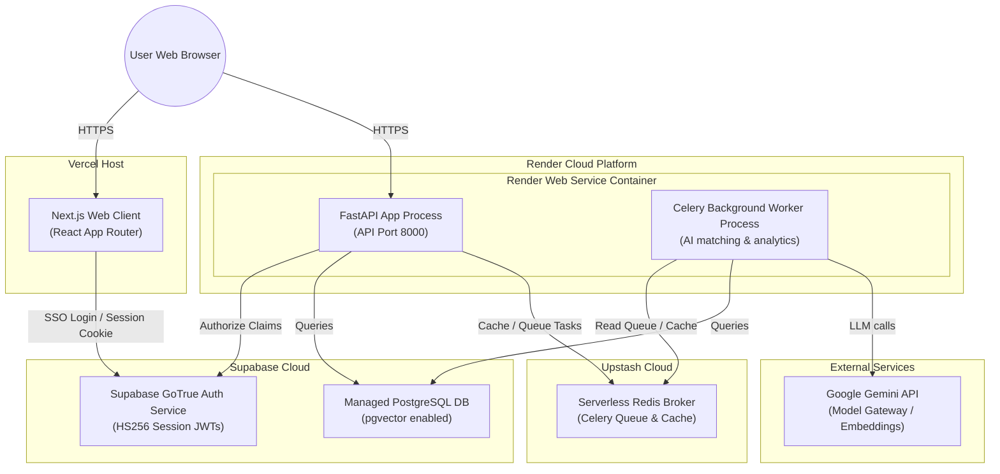

# Production Deployment & Hosting Architecture Guide

This document outlines the recommended hosting, deployment instructions, and cost projection for **Terzo Cost Intelligence** on **Vercel** and **Render** using **Supabase** as the database and auth provider.

---

## 1. Target Architecture (Vercel, Render & Supabase)

---

## 2. Component Setup & Instructions

### Next.js Frontend (Vercel)
* **Build Command**: `pnpm --filter web build`
* **Output Directory**: `.next`
* **Required Environment Variables**:
  * `NEXT_PUBLIC_API_BASE`: URL of your Render FastAPI deployment (e.g., `https://cost-intelligence-api.onrender.com/api/v1`).
  * `NEXT_PUBLIC_SUPABASE_URL`: Your Supabase Project API URL (e.g., `https://[ref].supabase.co`).
  * `NEXT_PUBLIC_SUPABASE_ANON_KEY`: Your Supabase Project Anon/Public Key.

### Unified FastAPI Backend & Celery Worker (Render)
To operate within Render's Free tier limits, both the API and the background worker are packaged and executed concurrently inside a single container using a startup script (`start.sh`).

#### 1. Supabase Database (Supabase)
* Provision a project on Supabase.
* Copy the standard transaction PostgreSQL connection string (port 5432 or 6543 pooled).

#### 2. Redis Cache (Upstash)
* Create a serverless Redis database on Upstash (free tier).
* Copy the Redis connection string.

#### 3. FastAPI Web Service (Render)
* Create a new **Web Service** on Render, pointing to your repo.
* **Runtime**: Docker
* **Docker Context**: Root of monorepo
* **Dockerfile Path**: `apps/api/Dockerfile`
* **Required Environment Variables**:
  * `ENVIRONMENT`: `production`
  * `DATABASE_URL`: Connection string of your Supabase Postgres database (e.g. `postgresql://...`).
  * `REDIS_URL`: Connection string of your Upstash Redis database (e.g. `redis://...`).
  * `SECRETS_PROVIDER`: `redis` (dynamic token caching).
  * `SUPABASE_JWT_SECRET`: Supabase JWT secret (for HS256 JWT validation).
  * `GEMINI_API_KEY`: Google Gemini Developer API key.
  * `CORS_ALLOWED_ORIGINS`: Comma-separated list of allowed origins (e.g. `http://localhost:3000, https://cost-intelligence-web.vercel.app`).

---

## 3. Sequential Deployment Guide (Backend First)

To deploy the stack correctly without circular dependencies, follow this step-by-step sequence:

### Step 1: Deploy the Backend on Render
1. Set up your **Supabase Project** database and **Redis** database on Upstash.
2. Deploy the FastAPI **Web Service** using the Dockerfile (Render will run `start.sh` automatically to apply migrations and spin up both the API and the Celery worker processes).
3. Configure the required environment variables.
4. Configure CORS to accept temporary origins:
   * **Set `CORS_ALLOWED_ORIGINS` to**: `http://localhost:3000, https://*.vercel.app` (permits local testing and Vercel preview hostings).
5. Once the Web Service is active, verify it is running on your Render URL: `https://cost-intelligence-api.onrender.com`.

### Step 2: Deploy the Frontend on Vercel
1. Set up a Next.js project on Vercel importing your monorepo.
2. In the project settings, configure the environment variables:
   * Set `NEXT_PUBLIC_API_BASE` to your deployed Render API URL: `https://cost-intelligence-api.onrender.com/api/v1`.
   * Complete the Supabase parameters (`NEXT_PUBLIC_SUPABASE_URL`, `NEXT_PUBLIC_SUPABASE_ANON_KEY`).
3. Deploy the frontend. Once active, copy the production frontend domain (e.g., `https://cost-intelligence-web.vercel.app`).

### Step 3: Lockdown & Finalize Security
1. Return to your **Render** dashboard for the FastAPI backend.
2. Update the `CORS_ALLOWED_ORIGINS` environment variable to lock it down exclusively to your production Vercel frontend domain:
   * **Set `CORS_ALLOWED_ORIGINS` to**: `http://localhost:3000, https://cost-intelligence-web.vercel.app` (removing the general wildcard).
3. In your **Supabase Dashboard** under **Authentication > URL Configuration**, add your Vercel production domain to the **Redirect URLs** list.

---

## 4. Cost Breakdown

Below is the actual cost for running the platform — **all services use free tiers**:

| Service Provider | Component | Tier / Size | Monthly Cost | Notes |
| :--- | :--- | :--- | :--- | :--- |
| **Vercel** | Frontend App | Hobby (Free) | **$0.00** | 100GB bandwidth, serverless functions, Edge CDN. |
| **Render** | API Backend | Free Tier | **$0.00** | 750 hrs/mo; spins down after 15min inactivity (~30s cold start). |
| **Supabase** | DB & Auth | Free Tier | **$0.00** | 500MB PostgreSQL (pgvector) + GoTrue Auth (50k MAUs). |
| **Upstash** | Redis Cache | Serverless Free Tier | **$0.00** | 10K commands/day; transient cache & queue broker. |
| **Google** | Gemini API | Free Tier | **$0.00** | 15 RPM (Pro) / 30 RPM (Flash); generous free quota. |
| **Total** | | | **$0.00 / month** | **100% free tier — no paid plans active.** |

---

## 5. Free-Tier Cold-Start & Keep-Warm Mitigation

Because the FastAPI backend runs on Render's **Free Tier**, the hosting container automatically spins down (goes to sleep) after 15 minutes of user inactivity. 

When a user visits the URL for the first time or refreshes the page after the service has spun down, they will experience a **cold start latency of ~30 seconds** while Render spins up the container.

### Mitigation Strategies

#### 1. Programmatic Frontend Retry & Warning (Implemented)
The frontend client in [CostIntelligenceApp.tsx](file:///apps/web/app/ci/CostIntelligenceApp.tsx) is equipped with a **boot-up cold-start resilience handler**:
- **Pulsing Loading State**: If the backend takes longer than 3 seconds to respond, a pulsing warning is displayed: `⚠️ The backend is waking up from free-tier sleep on Render. Please wait, this can take up to 30-40 seconds...`.
- **Exponential Backoff**: The app automatically retries the initial snapshot request up to 5 times (with increasing delays of 2s, 3s, 4.5s, 6.7s) before giving up and showing a connection error. This prevents the page load from failing or locking up during container startup.

#### 2. Ping-Based Keep-Warm Strategy (Recommended)
To keep the backend warm and prevent it from sleeping altogether, you can set up a free keep-alive monitor:
1. **Choose a Monitor**: Sign up for a free account on [UptimeRobot](https://uptimerobot.com/), [cron-job.org](https://cron-job.org/), or [Better Stack](https://betterstack.com/).
2. **Configure HTTP Ping**: Set up an HTTP check pointing to the root `/healthz` liveness endpoint:
   - **Target URL**: `https://cost-intelligence-api.onrender.com/healthz`
   - **Interval**: Run the ping check every **10 to 14 minutes** (Render sleeps at exactly 15 minutes of inactivity).
3. **Outcome**: The recurring HTTP request wakes up or keeps the Render container active, guaranteeing 0ms cold-start latency when users open the Vercel site.

