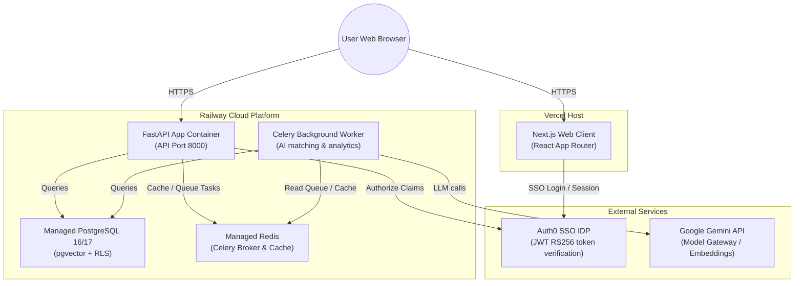

# Production Deployment & Hosting Architecture Guide

This document outlines the recommended hosting, deployment instructions, and cost projection for **Terzo Cost Intelligence** on **Vercel** and **Railway**.

---

## 1. Target Architecture (Vercel & Railway)



---

## 2. Component Setup & Instructions

### Next.js Frontend (Vercel)
* **Build Command**: `pnpm --filter web build`
* **Output Directory**: `.next`
* **Required Environment Variables**:
  * `NEXT_PUBLIC_API_BASE`: URL of your Railway FastAPI deployment (e.g., `https://api.yourdomain.com/api/v1`).
  * `AUTH0_SECRET`: Random 32-byte hex string.
  * `AUTH0_BASE_URL`: Vercel app domain (e.g., `https://your-app.vercel.app`).
  * `AUTH0_ISSUER_BASE_URL`: Your Auth0 domain (e.g., `https://tenant.us.auth0.com`).
  * `AUTH0_CLIENT_ID`: Auth0 Web Client ID.
  * `AUTH0_CLIENT_SECRET`: Auth0 Web Client Secret.

### FastAPI Backend & Celery Worker (Railway)
* **Build Method**: Dockerfile-based deploy (`apps/api/Dockerfile`).
* **Web Service**: Deploy the web process running:
  ```bash
  uv run uvicorn app.main:app --host 0.0.0.0 --port 8000
  ```
* **Celery Worker**: Deploy a duplicate service using the same repo/image but set the start command to:
  ```bash
  uv run celery -A app.workers.ingestion_tasks worker --loglevel=info
  ```
* **Required Environment Variables**:
  * `ENVIRONMENT`: `production`
  * `DATABASE_URL`: Connection string to your managed Railway Postgres instance.
  * `REDIS_URL`: Connection string to your managed Railway Redis instance.
  * `SECRETS_PROVIDER`: `redis` (uses Redis cache to store Dynamic OAuth tokens safely).
  * `AUTH0_DOMAIN`: Auth0 domain name.
  * `AUTH0_AUDIENCE`: Auth0 API Audience identifier.
  * `CORS_ALLOWED_ORIGINS`: Comma-separated list of allowed origins (e.g. `http://localhost:3000, https://your-app.vercel.app`).

---

## 3. Sequential Deployment Guide (Backend First)

To deploy the stack correctly without circular dependencies, follow this step-by-step sequence:

### Step 1: Deploy the Backend on Railway
1. Set up your **PostgreSQL** and **Redis** database services on Railway.
2. Deploy the FastAPI app service using `apps/api/Dockerfile`.
3. Configure the required environment variables (Database URLs, Auth0, Gemini Key).
4. Configure CORS to accept temporary origins:
   * **Set `CORS_ALLOWED_ORIGINS` to**: `http://localhost:3000, https://*.vercel.app` (permits local testing and Vercel preview hostings).
5. Deploy the backend. Once active, copy the assigned public service URL (e.g., `https://your-api.up.railway.app`).

### Step 2: Deploy the Frontend on Vercel
1. Set up a new Next.js project on Vercel importing your monorepo.
2. In the project settings, configure the environment variables:
   * Set `NEXT_PUBLIC_API_BASE` to your deployed Railway API URL (e.g., `https://your-api.up.railway.app/api/v1`).
   * Complete the Auth0 parameters.
3. Deploy the frontend. Once active, copy the production frontend domain (e.g., `https://your-app.vercel.app`).

### Step 3: Lockdown & Finalize Security
1. Return to your **Railway** dashboard for the FastAPI backend.
2. Update the `CORS_ALLOWED_ORIGINS` environment variable to lock it down exclusively to your production Vercel frontend domain:
   * **Set `CORS_ALLOWED_ORIGINS` to**: `http://localhost:3000, https://your-app.vercel.app` (removing the general wildcard).
3. In your **Auth0 Application Dashboard**, add your Vercel production domain to the **Allowed Callback URLs**, **Allowed Logout URLs**, and **Allowed Origins (CORS)** lists.

---

## 4. Cost Breakdown

Below is a detailed cost estimation for running the platform in a standard production environment:

| Service Provider | Component | Tier / Size | Estimated Monthly Cost | Notes |
| :--- | :--- | :--- | :--- | :--- |
| **Vercel** | Frontend App | Pro Plan | **$20.00** | Includes team collaboration, preview deployments, and global CDN. |
| **Railway** | FastAPI API | Container (512MB RAM, 0.5 CPU) | **$10.00** | Scaled automatically depending on traffic. |
| **Railway** | Celery Worker | Container (512MB RAM, 0.5 CPU) | **$10.00** | Runs background matching and ingestion tasks. |
| **Railway** | PostgreSQL | Shared DB (1GB RAM, 10GB SSD) | **$15.00** | Managed Postgres with `pgvector` enabled. |
| **Railway** | Redis Cache | Shared Cache (256MB RAM) | **$5.00** | Celery broker and transient secrets store. |
| **Auth0** | Identity Provider | B2C Essentials | **$23.00** | Paid tier required for custom domain SSL and compliance. |
| **Google** | Gemini API | Pay-as-you-go | **$15.00** | Estimate based on processing ~200 contracts/month. |
| **Total** | | | **$98.00 / month** | **Highly cost-effective baseline for production.** |
